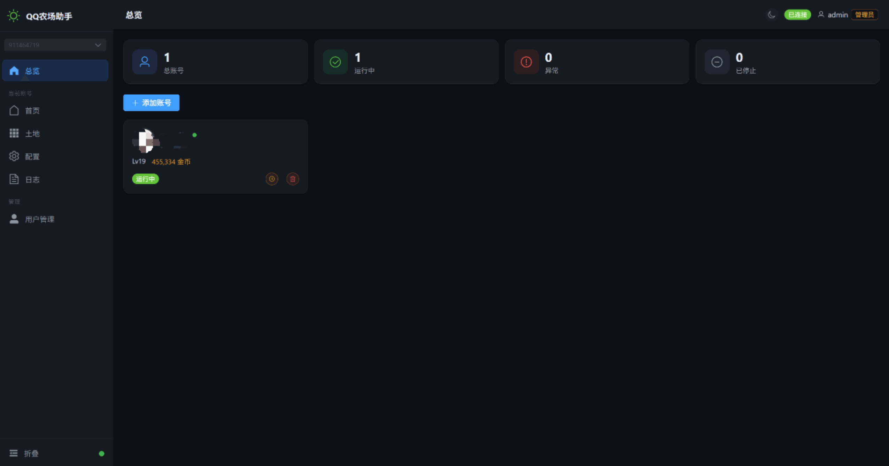
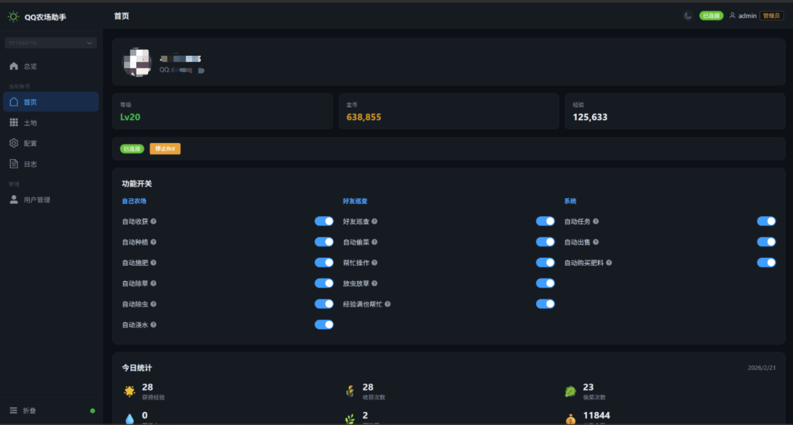

<div align="center">

# QQ-FARM-BOT

QQ 农场全自动挂机管理平台 — 多账号、可视化、实时控制

[](LICENSE) [](package.json) [](https://nodejs.org) [](https://vuejs.org)

</div>

---

基于 Node.js + Vue 3 构建的 QQ 农场自动化工具，支持多账号同时管理，提供 Web 可视化面板，实现种植、收获、偷菜、任务领取、仓库出售等全流程自动化。


---

## 功能特性

### 农场自动化
- **自动收获** — 成熟作物即时收取
- **智能种植** — 根据经验/小时效率排名自动选择最优种子
- **自动施肥** — 种植后自动购买并施加肥料加速生长
- **自动除草 / 除虫 / 浇水** — 保持农场健康状态
- **自动任务** — 自动领取已完成的成长任务和每日任务奖励
- **自动出售** — 定时清理背包果实换取金币

### 好友系统
- **自动偷菜** — 智能检测好友成熟作物并偷取
- **帮好友浇水 / 除草 / 除虫** — 互助获取经验
- **智能预筛选** — 跳过无事可做的好友，减少无效请求

### 多用户权限
- **管理员 / 普通用户** 两级角色
- 管理员可管理所有账号，普通用户仅能操作被授权的 QQ 号
- JWT 认证，Session 数据 AES-256-CBC 加密存储

### 可视化面板
- **仪表盘** — 总览所有账号状态（运行中 / 停止 / 异常）
- **账号主页** — 等级、金币、经验、今日统计、功能开关实时切换
- **土地详情** — 每块地的植物、生长阶段、剩余时间
- **种植效率排行** — 根据等级动态计算作物经验/小时排名（含多季作物）
- **实时日志** — WebSocket 推送 Bot 运行日志
- **深色 / 浅色主题** 一键切换
- **移动端适配** — 手机也能正常使用

### 功能开关一览

每个账号可独立配置：

| 开关 | 默认 | 说明 |
|:---|:---:|:---|
| 自动收获 | ✅ | 收取成熟作物 |
| 自动种植 | ✅ | 收获后自动种植最优作物 |
| 自动施肥 | ✅ | 种植后自动施肥 |
| 自动除草 | ✅ | 清除杂草 |
| 自动除虫 | ✅ | 清除害虫 |
| 自动浇水 | ✅ | 给干旱地块浇水 |
| 好友巡查 | ✅ | 定时访问好友农场 |
| 自动偷菜 | ✅ | 偷取好友成熟作物 |
| 帮好友干活 | ✅ | 帮好友浇水/除草/除虫 |
| 经验满也帮忙 | ✅ | 帮好友浇水/除草/除虫 |
| 好友放虫草 | ✅ | 给好友放虫/放草 |
| 自动任务 | ✅ | 领取任务奖励 |
| 自动出售 | ✅ | 出售背包果实 |
| 自动购肥 | ✅ | 施肥时自动购买肥料 |

---

## 应用截图

| 账号管理 | 账号主页 |
|:---:|:---:|
|  |  |

| 土地详情 | 设置 & 种植排行 |
|:---:|:---:|
|  |  |

| 实时日志 | 用户管理 |
|:---:|:---:|
|  |  |
---
## 技术栈

| 层 | 技术 |
|:---|:---|
| 后端 | Node.js + Express + Socket.io + WebSocket (ws) |
| 前端 | Vue 3 + Vite 6 + Element Plus + Vue Router + Pinia |
| 协议 | Protobuf (protobufjs) 编解码游戏消息 |
| 数据库 | SQLite (sql.js，纯 JS 无需 native 编译) |
| 认证 | 自实现 JWT (HMAC-SHA256) + SHA-256 密码哈希 |
| 加密 | AES-256-CBC 加密 Session 存储 |
| 实时通信 | Socket.io (前后端) + WebSocket (游戏服务器) |

---

## 项目结构

```
qq-farm-bot/
├── server/                  # 后端服务
│   ├── index.js             # 服务器入口 (Express + Socket.io)
│   ├── bot-instance.js      # Bot 实例 (核心农场逻辑)
│   ├── bot-manager.js       # Bot 管理器 (多账号调度)
│   ├── routes.js            # REST API 路由
│   ├── auth.js              # JWT 认证中间件
│   ├── database.js          # SQLite 数据库
│   └── qr-service.js        # QR 扫码登录服务
├── web/                     # 前端 (Vue 3 SPA)
│   └── src/
│       ├── views/           # 页面: 仪表盘/主页/土地/设置/日志/管理
│       ├── layouts/         # MainLayout (侧边栏 + 顶栏)
│       ├── stores/          # Pinia 状态管理 (auth/theme)
│       ├── api/             # Axios API 封装
│       └── socket/          # Socket.io 客户端
├── src/
│   ├── proto.js             # Protobuf 加载器
│   ├── config.js            # 游戏常量配置
│   └── gameConfig.js        # 植物/等级/物品配置解析
├── proto/                   # Protobuf 协议定义文件
├── gameConfig/              # 游戏数据 (Plant.json / ItemInfo.json / RoleLevel.json)
├── tools/                   # 辅助工具 (经验收益计算器)
└── data/                    # 运行时数据 (SQLite 数据库文件)
```

---

## 快速开始

### 环境要求

- **Node.js** >= 16

### 安装

```bash
git clone https://github.com/your-username/qq-farm-bot.git
cd qq-farm-bot

# 一键安装所有依赖 (后端 + 前端)
npm run setup
```

### 构建前端

```bash
npm run build:web
```

### 启动服务

```bash
npm start
```

服务器默认运行在 `http://localhost:3000`。

### 登录

首次启动会自动创建默认管理员账号：

| 用户名 | 密码 |
|:---:|:---:|
| `admin` | `admin123` |

> **请登录后立即修改默认密码！**

### 添加 QQ 账号

1. 登录 Web 管理面板
2. 点击「添加账号」
3. 使用 QQ 扫描二维码
4. 扫码成功后 Bot 自动启动挂机

---

## 环境变量

| 变量 | 默认值 | 说明 |
|:---|:---|:---|
| `PORT` | `3000` | 服务端口 |
| `JWT_SECRET` | 内置随机值 | JWT 签名密钥 |
| `BOT_ENCRYPT_KEY` | 内置默认值 | Session 加密密钥 |

---

## API 概览

<details>
<summary>点击展开完整 API 列表</summary>

### 认证
| 方法 | 路径 | 说明 |
|:---|:---|:---|
| POST | `/api/auth/login` | 用户名密码登录 |
| POST | `/api/auth/change-password` | 修改密码 |
| GET | `/api/auth/me` | 获取当前用户信息 |

### 账号管理
| 方法 | 路径 | 说明 |
|:---|:---|:---|
| GET | `/api/accounts` | 账号列表 |
| GET | `/api/accounts/:uin/snapshot` | 账号完整快照 |
| GET | `/api/accounts/:uin/lands` | 土地详情 |
| GET | `/api/accounts/:uin/logs` | Bot 日志 |
| PUT | `/api/accounts/:uin/toggles` | 更新功能开关 |
| PUT | `/api/accounts/:uin/config` | 更新巡查间隔 |
| DELETE | `/api/accounts/:uin` | 删除账号 |

### QR 登录 & Bot 控制
| 方法 | 路径 | 说明 |
|:---|:---|:---|
| POST | `/api/accounts/:uin/qr-login` | 发起扫码登录 |
| POST | `/api/accounts/:uin/qr-cancel` | 取消扫码 |
| POST | `/api/accounts/:uin/start` | 启动 Bot |
| POST | `/api/accounts/:uin/stop` | 停止 Bot |

### 数据查询
| 方法 | 路径 | 说明 |
|:---|:---|:---|
| GET | `/api/plant-ranking?level=25` | 种植效率排行 |

### 管理员
| 方法 | 路径 | 说明 |
|:---|:---|:---|
| GET | `/api/admin/users` | 用户列表 |
| POST | `/api/admin/users` | 创建用户 |
| PUT | `/api/admin/users/:id` | 更新用户 |
| DELETE | `/api/admin/users/:id` | 删除用户 |

</details>

---

## 实时通信事件 (Socket.io)

| 事件 | 方向 | 说明 |
|:---|:---:|:---|
| `accounts:list` | S → C | 推送所有账号状态 |
| `bot:log` / `bot:log:all` | S → C | Bot 日志推送 |
| `bot:statusChange` | S → C | Bot 状态变更 |
| `bot:stateUpdate` | S → C | 游戏状态更新 (等级/金币/经验) |
| `qr:expired` / `qr:scanned` | S → C | QR 扫码状态 |
| `logs:subscribe` / `logs:unsubscribe` | C → S | 订阅/取消账号日志 |

---

## 致谢

本项目在学习和开发过程中参考了以下优秀的开源项目，在此表示感谢：

- [linguo2625469/qq-farm-bot](https://github.com/linguo2625469/qq-farm-bot) — QQ 农场 Bot 核心实现
- [lkeme/QRLib](https://github.com/lkeme/QRLib) — QQ 扫码登录库
- [QianChenJun/qq-farm-bot](https://github.com/QianChenJun/qq-farm-bot) — QQ 农场 Bot 参考实现

---

## 免责声明

本项目仅供学习和研究用途，请勿用于任何商业用途或违反服务条款的行为。使用本项目造成的任何后果由使用者自行承担。

---

## 许可证

[MIT License](LICENSE)
